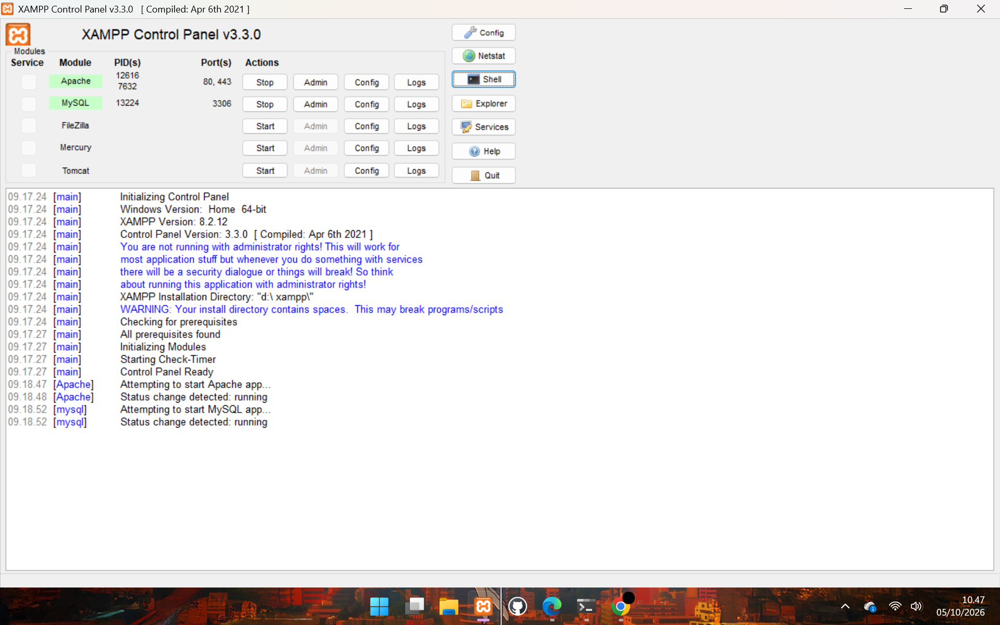
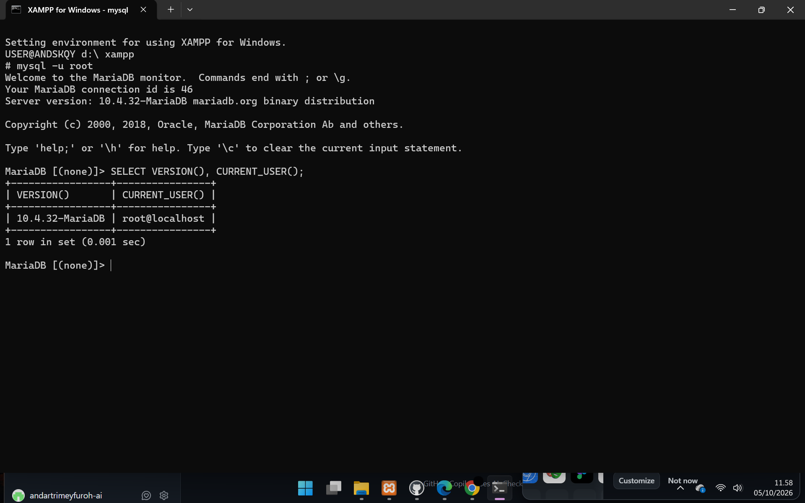
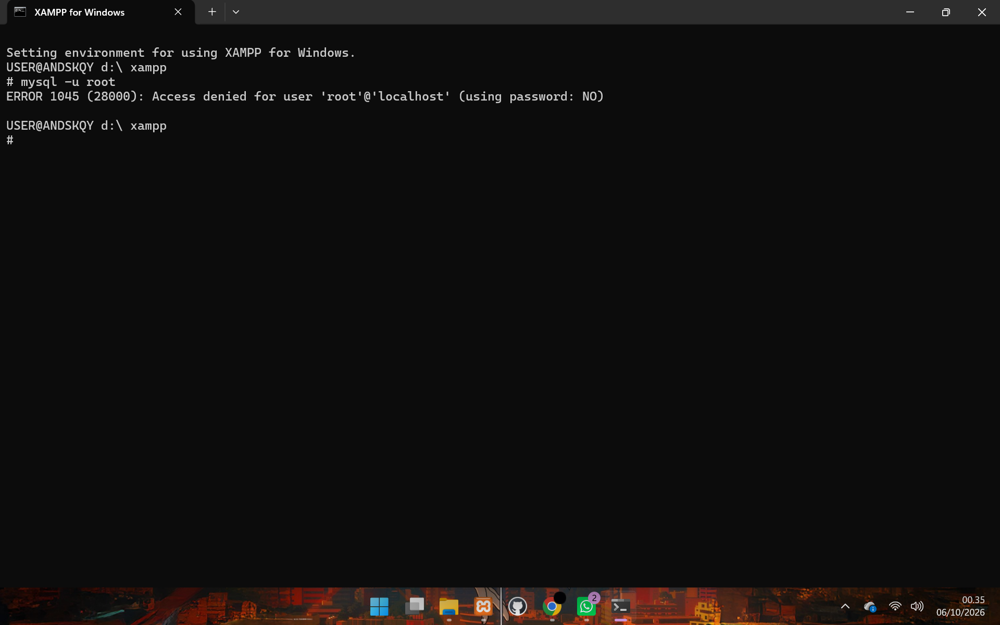
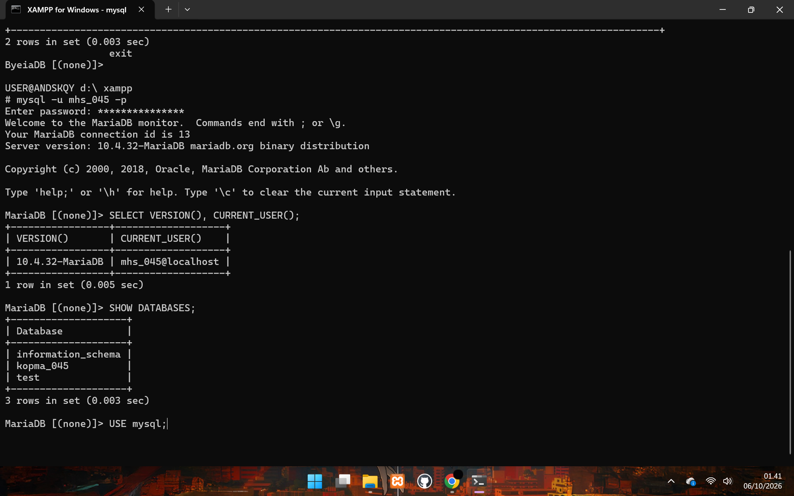
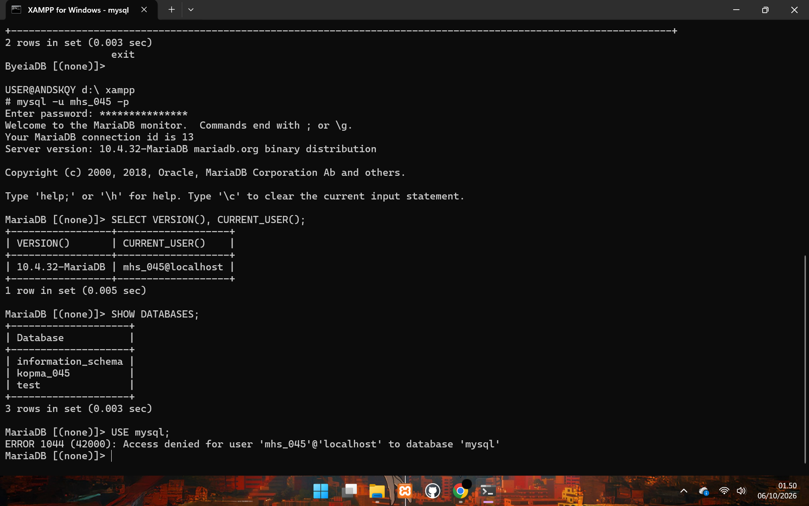
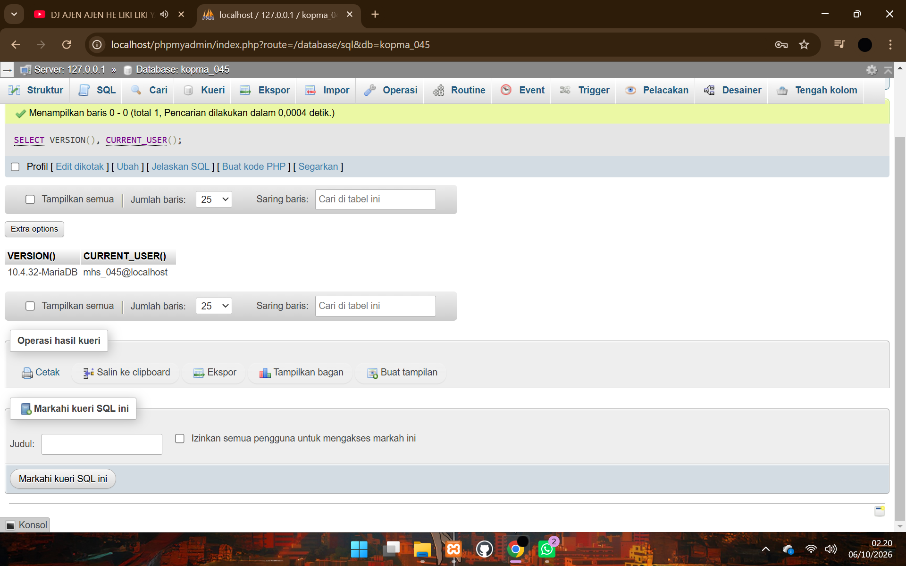
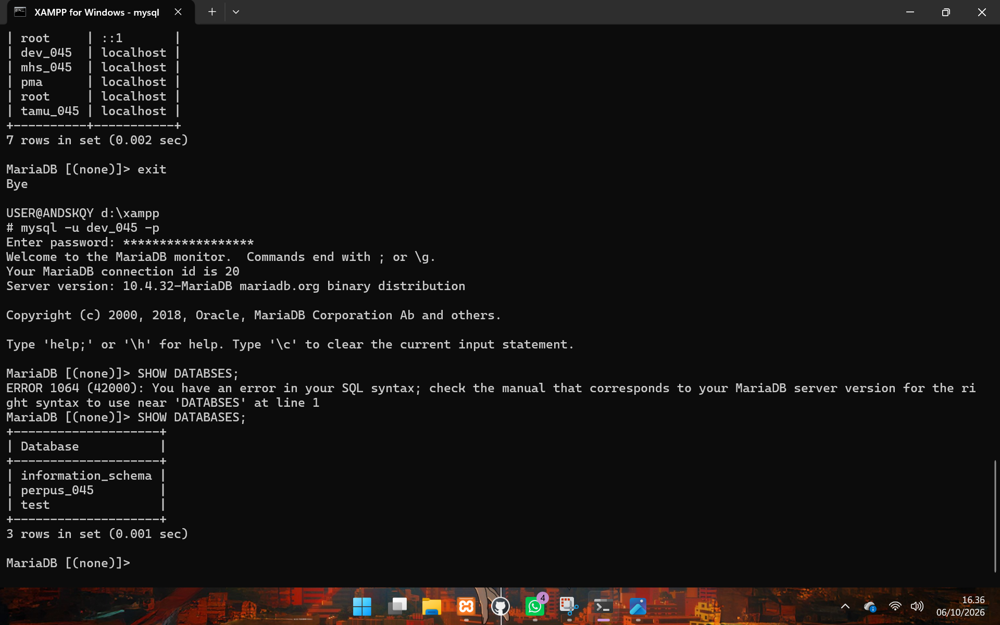
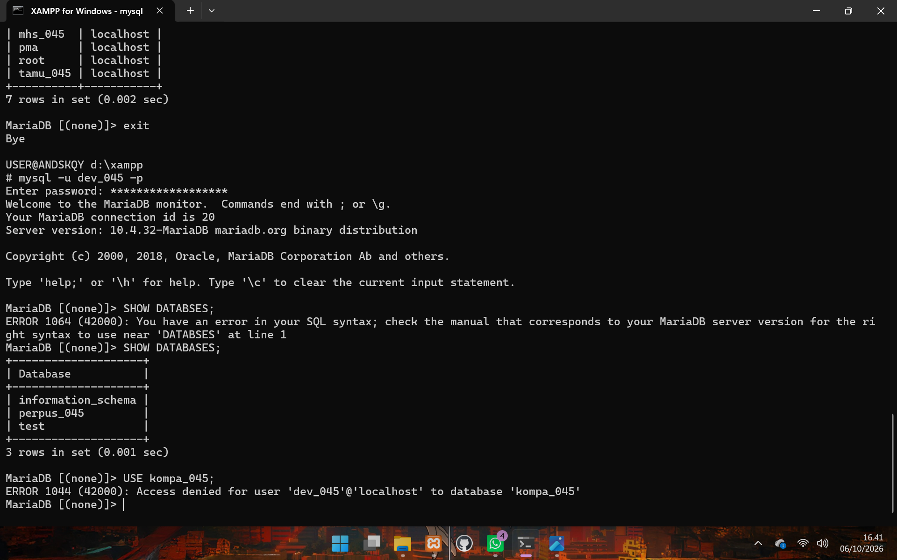
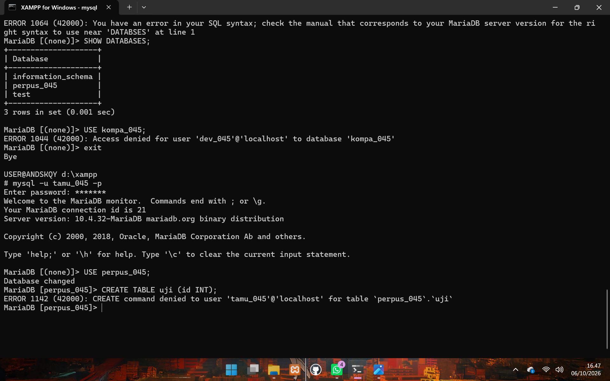

# LAPORAN PRAKTIKUM BASIS DATA
## P01: Lingkungan Kerja dan Kontrol Akses Basis Data

---

### Identitas Proyek

| Aspek | Keterangan |
|-------|-----------|
| **Nama Mahasiswa** | Andar Tri Mey Furoh |
| **NIM** | 25430045 |
| **Kelas** | B |
| **Tanggal Praktikum** | 7 Oktober 2026 |
| **Tema Proyek** | Perpustakaan |
| **Nama Organisasi Fiktif** | Kopma Perpustakaan Metro (Inisial: KPM) |

**Dosen Pengampu:** Dedi Irawan S.Kom. M.T.I.  
**Mata Kuliah:** Praktikum  Basis Data  
**Sumber:** Buku Praktikum Basis Data Edisi Uji Coba, UM Metro

---

## 1. Tujuan Praktikum

1. Memahami konsep Database Management System (DBMS) dan fungsinya dalam mengelola data
2. Menguasai instalasi dan konfigurasi MariaDB serta XAMPP sebagai lingkungan kerja database
3. Memahami perbedaan akun root (administrator) dan akun kerja (restricted user) serta pentingnya kontrol akses
4. Menguasai penggunaan Git dan GitHub untuk version control dalam project basis data

---

## 2. Ringkasan Dasar Teori

### 2.1 DBMS dan MariaDB
DBMS (Database Management System) adalah perangkat lunak yang bertugas untuk mengelola, menyimpan, dan mengambil data secara terstruktur. Kalau diibaratkan, DBMS itu seperti sistem lemari arsip digital pintar: dia tidak hanya menyediakan tempat untuk menaruh berkas, tetapi juga mengatur tata letaknya, menjaga keamanannya, serta memudahkan siapa saja yang punya hak akses untuk mencari dokumen tertentu dalam hitungan detik. Tanpa DBMS, pengelolaan data jumlah besar bakal sangat kacau dan rentan hilang atau tertimpa.

MariaDB sendiri merupakan salah satu jenis DBMS berbasis open-source (gratis) yang sangat populer. Di dalam sistem basis data, MariaDB punya beberapa fungsi utama:

Menyimpan dan Mengorganisir Data: Menyimpan informasi ke dalam bentuk tabel-tabel yang saling terhubung (Relational Database) agar rapi dan mudah diolah.

Memproses Perintah SQL: Menjalankan perintah query seperti menambah, mengubah, menghapus, atau menampilkan data (Create, Read, Update, Delete).

Menjaga Keamanan Data: Mengatur hak akses pengguna, jadi tidak semua orang bisa sembarangan melihat atau mengubah data sensitif.

Menjaga Konsistensi (ACID): Memastikan transaksi data berjalan aman. Kalau ada gangguan pas proses transaksi berlangsung, sistem bakal otomatis mengembalikan data ke kondisi awal supaya tidak korup.

Mengapa topik ini sangat penting dalam mata kuliah Basis Data? Karena basis data adalah "pondasi" dari hampir semua aplikasi dan sistem informasi yang ada saat ini. Mempelajari DBMS seperti MariaDB memberikan pemahaman langsung tentang bagaimana data di balik layar sebuah aplikasi bekerja—mulai dari perancangan struktur data yang efisien, optimasi pencarian, hingga penanganan banyak pengguna yang mengakses sistem secara bersamaan. Pengetahuan ini jadi modal utama yang wajib dimiliki kalau nanti ingin berkarier sebagai backend developer, data engineer, maupun database administrator.

 
### 2.2 Akun Root vs Akun Kerja
Akun Root (Administrator)  yaitu seperti  Pemilik Gedung yang pegang master key (kunci utama).

Kamu punya akses penuh ke semua ruangan, bahkan yang paling rahasia sekalipun.

Kamu bebas membongkar tembok, mengganti papan nama perusahaan, mematikan listrik seluruh gedung, sampai ngusir siapa saja yang ada di dalam.

Tidak ada ruang yang terkunci buat kamu, dan tidak ada sistem yang bisa melarang apa yang mau kamu lakukan.

Sedangkan Akun Kerja (User Biasa) itu ibarat Karyawan yang punya kartu akses khusus.

Kamu cuma bisa masuk ke kubikel sendiri, ruang rapat, atau toilet.

Kamu bisa mengetik dokumen, mengirim email, dan melakukan pekerjaan sehari-hari dengan nyaman.

Tapi kalau mau membongkar tembok kantor atau mematikan listrik gedung, kartu aksesmu bakal ditolak otomatis.
Perbedaan Privilege (Hak Akses)
Hal yang Diatur	Akun Root (Admin)	Akun Kerja (User)
Instal / Hapus Aplikasi	Bebas pasang atau hapus aplikasi apa saja di dalam sistem.	Cuma bisa pakai aplikasi yang sudah disediakan/diizinkan.
Ubah Sistem Utama	Bisa mengutak-atik file inti sistem (system files) dan konfigurasi vital.	Tidak bisa menyentuh file sistem utama. Cuma bisa atur profil pribadi (misal: ganti wallpaper).
Akses File Orang Lain	Bisa membaca, mengubah, atau menghapus file milik semua pengguna lain.	Cuma bisa buka file milik sendiri atau file yang sengaja dibagikan (shared).
Kelola Pengguna	Bisa bikin akun baru, ganti kata sandi orang lain, atau menghapus akun.

### 2.3 Git dan GitHub untuk Version Control
 Git adalah sistem Version Control (pengontrol versi) yang mencatat setiap perubahan pada file proyekmu dari waktu ke waktu.

Fungsi Utama Git
Lacak Riwayat Perubahan (History): Git menyimpan catatan lengkap tentang siapa yang mengubah kode, bagian mana yang diubah, dan kapan perubahan itu dibuat. Kalau ada bug atau error, kamu bisa melihat kembali sejarahnya dengan jelas.

Fitur "Mesin Waktu" (Rollback): Kalau kode baru yang kamu tulis malah bikin aplikasi crash atau rusak, kamu bisa dengan mudah mengembalikan proyek ke kondisi stabil sebelumnya.

Bekerja di Jalur Terpisah (Branching): Kamu bisa membuat "cabang" baru untuk mencoba fitur baru tanpa mengganggu kode utama yang sudah jalan. Kalau fiturnya sudah selesai dan bebas error, baru digabungkan (merge) kembali ke kode utama.

Kolaborasi Tanpa Saling Timpa: Git memungkinkan banyak orang mengerjakan file yang sama secara bersamaan. Git akan membantu menggabungkan perubahan dari masing-masing orang secara otomatis.

Mengapa Git Sangat Penting dalam Proyek?
Mencegah Bencana Kode Rusak: Tanpa Git, sekali kamu menimpa file dengan kode yang salah dan menekan tombol Save, kode lamamu bisa hilang selamanya. Git memberikan "jaring pengaman" supaya kamu bebas bereksperimen tanpa takut merusak proyek.

Kolaborasi Tim Jadi Lancar: Kalau ada 5 orang programmer mengerjakan satu aplikasi tanpa Git, mereka harus saling kirim file lewat WhatsApp/Google Drive dan bingung menyatukan kodenya. Dengan Git, semua anggota tim bisa bekerja di komputernya masing-masing lalu menggabungkannya ke pusat (repository seperti GitHub atau GitLab) dengan rapi.

Akuntabilitas & Transparansi: Kamu bisa tahu dengan pasti siapa yang menambahkan atau menghapus baris kode tertentu. Ini memudahkan tim untuk saling mengevaluasi (code review) dan berdiskusi jika ada masalah.

Standar Industri: Hampir seluruh perusahaan teknologi, proyek open-source, dan tim pengembang software di dunia menggunakan Git. Menguasai Git adalah keterampilan wajib kalau kamu mau terjun ke dunia pengembangan perangkat lunak.

---

## 3. Hasil Langkah Percobaan

### 3.1 Inisialisasi XAMPP dan MariaDB

**Deskripsi:** Memastikan XAMPP Control Panel aktif dan MariaDB (port 3306) berjalan.

*Keterangan: XAMPP Control Panel menunjukkan MySQL berjalan pada port 3306*

---

### 3.2 Login sebagai Root dan Verifikasi Basis Data

**Deskripsi:** Login menggunakan akun root untuk melihat versi MariaDB dan database yang tersedia.

*Keterangan: Hasil login root menampilkan versi MariaDB dan daftar database*

---

### 3.3 Error 1045: Access Denied (Tanpa Password)

**Deskripsi:** Mencoba login tanpa flag `-p` menghasilkan error 1045.

*Keterangan: Error "Access denied for user 'root'@'localhost'" ketika tidak menyertakan flag password*

---

### 3.4 Login Akun Kerja (mhs_045)

**Deskripsi:** Login menggunakan akun kerja `mhs_045` yang memiliki privilege terbatas pada database `kopma_045`.

*Keterangan: Akun mhs_045 login dengan password bingung123*

---

### 3.5 Error 1044: Access Denied untuk Database (mhs_045)

**Deskripsi:** Akun `mhs_045` mencoba mengakses database `mysql` tetapi ditolak (hanya punya akses ke `kopma_045`).

*Keterangan: Error "Access denied for user 'mhs_045'@'localhost' to database 'mysql'"*

---

### 3.6 phpMyAdmin Interface

**Deskripsi:** Tampilan phpMyAdmin sebagai akun `mhs_045` menjalankan query SQL.

*Keterangan: Tab SQL di phpMyAdmin terbatas hanya pada database yang diizinkan*

---

### 3.7 Login Akun dev_045 dan SHOW DATABASES

**Deskripsi:** Akun `dev_045` login dan menampilkan daftar database yang diizinkan.

*Keterangan: dev_045 dapat mengakses database perpus_045 dan information_schema*

---

### 3.8 Error 1044: Access Denied untuk Database (dev_045)

**Deskripsi:** Akun `dev_045` mencoba mengakses database `kopma_045` tetapi ditolak.

*Keterangan: dev_045 hanya diizinkan mengakses perpus_045, bukan kopma_045*

---

### 3.9 Error 1142: CREATE TABLE Denied (tamu_045)

**Deskripsi:** Akun `tamu_045` hanya memiliki privilege SELECT (read-only) pada `perpus_045`, tidak bisa membuat tabel.

*Keterangan: Error "CREATE command denied for user 'tamu_045'@'localhost' for table 'perpus_045.uji'"*

---

## 4. Jawaban Titik Analisis (TA 1-4)

### TA 1: Perbedaan Error 1045, 1044, dan 1142

**Error 1045 — Access Denied (Authentication Failed)**
 Terjadi saat login dengan password salah atau akun tidak terdaftar dan terkadang xampp juga erorr mysqlnya tidak bisa dinyalakan

**Error 1044 — Access Denied (Authorization Failed - Database Level)**

Akun memiliki privilege terbatas pada database tertentu

**Error 1142 — Access Denied (Authorization Failed - Table Level)**
Akun hanya punya privilege SELECT, tidak punya CREATE TABLE

---

### TA 2: Mengapa Perlu Akun Kerja Selain Root?

Menggunakan akun root untuk semua operasi membuka celah keamanan. Akun kerja dengan privilege terbatas menerapkan prinsip least privilege.

---

### TA 3: Apa Fungsi Flag `-p` dalam `mysql -u root -p`?

Flag -p meminta pengguna memasukkan password secara interaktif. Ini lebih aman daripada menulis password langsung di command line.

---

### TA 4: Perbedaan Privilege ALL vs SELECT pada Database

Privilege ALL memungkinkan CREATE, ALTER, DROP, INSERT, UPDATE, DELETE. Privilege SELECT hanya membaca data tanpa mengubahnya.

---

## 5. Hasil Latihan dan Modifikasi

Pada praktikum ini, saya membuat 3 akun kerja (mhs_045, dev_045, tamu_045) dengan privilege berbeda untuk mendemonstrasikan kontrol akses..

---

## 6. Tugas Mandiri: Milestone Proyek 1

**Tema Proyek:** Perpustakaan (Sistem Manajemen Perpustakaan Metro)

**Rencana Basis Data:**
- Database: `perpus_045` (untuk developer) dan `kopma_045` (untuk kopma)
- Tabel yang akan dibuat: `daftar_buku`, `peminjam`, `transaksi_peminjaman`
- Akun yang digunakan: `mhs_045` (student), `dev_045` (developer), `tamu_045` (read-only visitor)

*(Lanjutkan dengan rencana Anda sendiri untuk milestone berikutnya)*

---

## 7. Pembahasan dan Kendala

### Kendala yang Dihadapi:

1. **Folder XAMPP Bernama Salah (spasi di depan)**
   - Solusi: Rename folder dari " xampp" menjadi "xampp", update path di my.ini

2. **Database dan Akun Hilang Setelah Reimport**
   - Solusi: Jalankan ulang script `p01_lingkungan_25430045.sql` sebagai root

3. **Git Repository Tidak Terbaca**
   - Solusi: Pindahkan ke drive D yang benar dan verifikasi folder `.git` tersembunyi

*(Tambahkan pembahasan lebih dalam tentang konsep yang dipelajari)*

---

## 8. Kesimpulan

Pada praktikum P01 ini, kami berhasil:
1. Mengkonfigurasi XAMPP dan MariaDB sebagai lingkungan kerja database
2. Membuat dan mengelola akun basis data dengan privilege berbeda (root, developer, read-only)
3. Memahami tiga jenis error (1045, 1044, 1142) yang menunjukkan level keamanan berbeda
4. Menerapkan version control dengan Git dan GitHub untuk tracking project

*(Tulis kesimpulan Anda dengan 3-4 kalimat tambahan)*

---

## 9. Pernyataan Penggunaan AI

Dalam pengerjaan laporan ini, saya menggunakan bantuan AI (Claude) untuk:
 penjelasan konsep dan meminta pemahaman serta ada juga debugging error 
---

## 10. Bukti Git

**Repository:** https://github.com/andartrimeyfuroh-ai/basisdata-25430045

**Commit History:**
- `df1cfc2` — p01: inisialisasi repositori dan skrip lingkungan
- `8d7fee8` — p01: milestone proyek 1
- `[commit terbaru]` — p01: tambah laporan dan screenshot bukti

**Link ke commit terakhir:** `https://github.com/andartrimeyfuroh-ai/basisdata-25430045/commit/[hash]`

---

**Laporan ini dinyatakan asli dan dibuat oleh Andar Tri Mey Furoh pada 7 Oktober 2026.**

