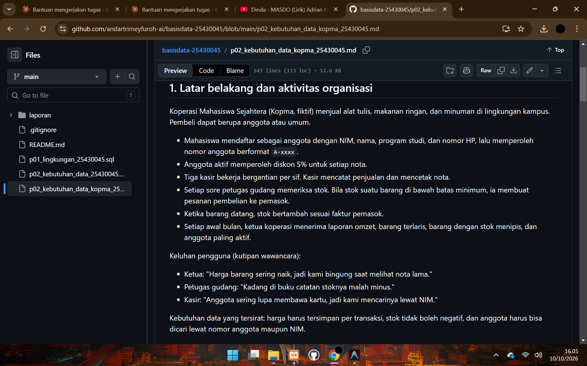
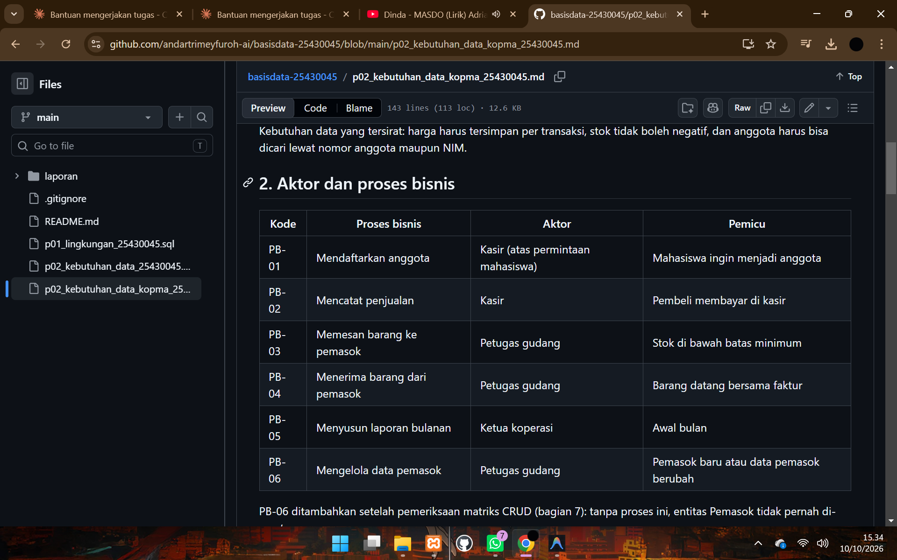
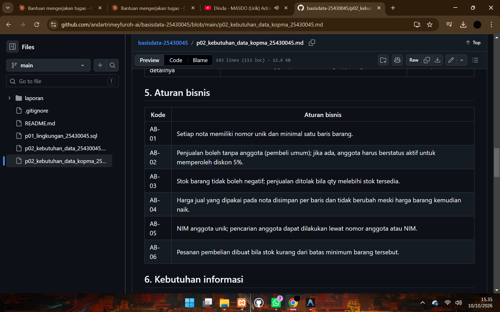
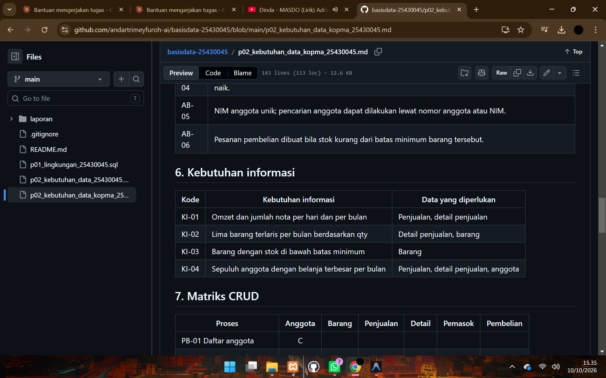
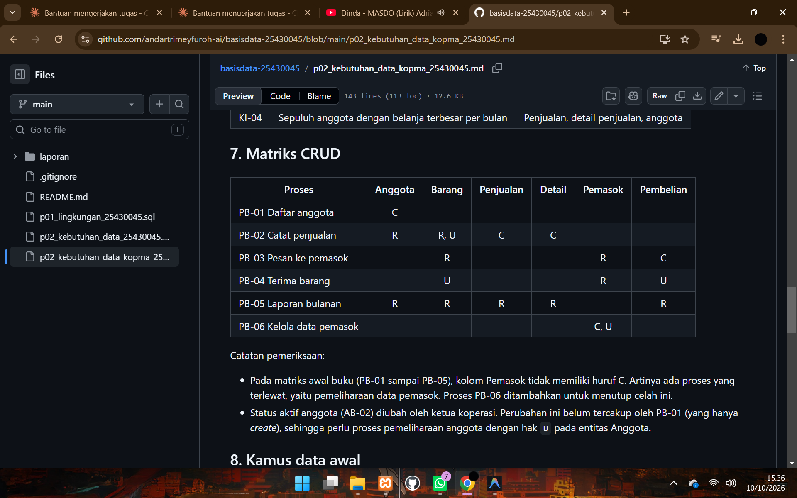
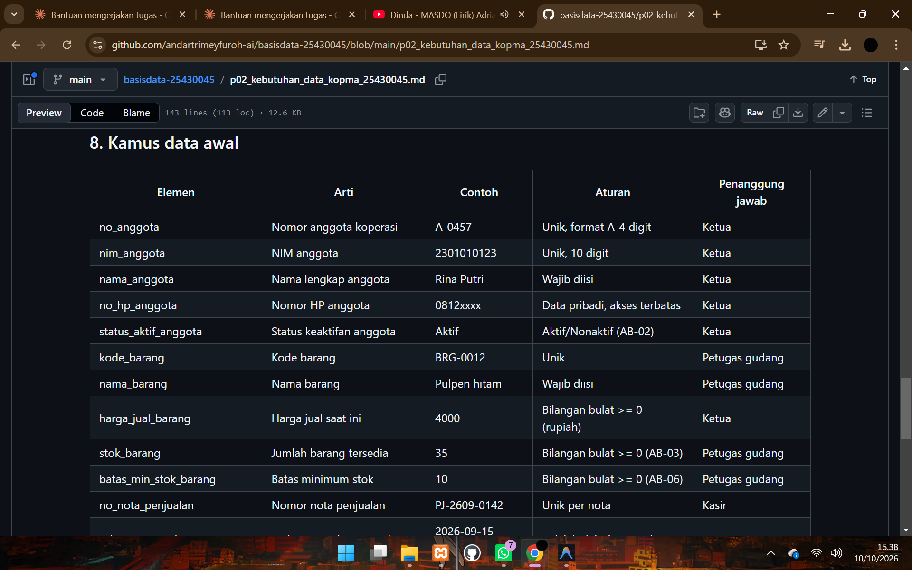
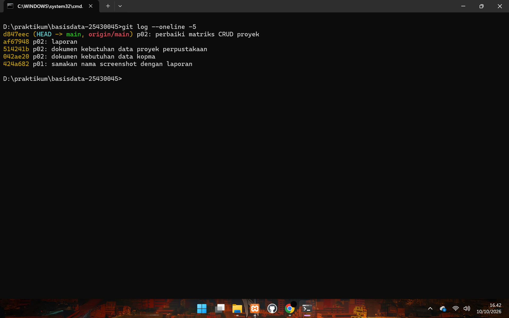

# Laporan Praktikum Basis Data - Pertemuan 02

**Nama:** Andar tri mey furoh   **NIM:** 25430045    **Kelas:** B   **Tanggal:** 07 Oktober 2026

**Asisten/Dosen:** Dedi Irawan, S.Kom, M.T.I.

---

## 1. Tujuan Praktikum

- Menemukan kegiatan, pelaku, dan proses bisnis dari cerita studi kasus, wawancara, dan nota.
- Menurunkan elemen data, entitas, dan aturan bisnis dari dokumen sumber.
- Menyusun matriks CRUD dan kamus data awal beserta penanggung jawab data.
- Menulis kebutuhan data dan informasi yang jelas dan bisa diuji.

## 2. Ringkasan Dasar Teori

Perancangan basis data dimulai dari analisis kebutuhan sebelum menggambar entitas, karena salah memahami kebutuhan di awal akan mahal diperbaiki setelah data terlanjur tercatat. Kebutuhan digali dari wawancara, pengamatan, dokumen sumber, dan sistem lama, lalu dibagi menjadi kebutuhan data, kebutuhan informasi, aturan bisnis, dan kebutuhan non-fungsional.

Matriks CRUD dipakai untuk memeriksa kelengkapan proses: entitas yang tidak pernah dibuat berarti ada proses yang terlewat. Kamus data menjelaskan tiap elemen dan siapa penanggung jawabnya, sehingga data diperlakukan sebagai aset. Kebutuhan yang baik harus spesifik, terukur, dan dapat diuji.

## 3. Hasil Langkah Percobaan

### 3.1 Aktor dan proses bisnis Kopma (D.2)

Kata kerja pada narasi: mendaftar, mencatat, mencetak, memeriksa, memesan, menerima, menyusun. Dikelompokkan per pelaku menjadi enam proses (PB-06 ditambahkan setelah pemeriksaan matriks CRUD).

| Kode  | Proses bisnis                  | Aktor                             | Pemicu                                  |
|-------|--------------------------------|-----------------------------------|-----------------------------------------|
| PB-01 | Mendaftarkan anggota           | Kasir (atas permintaan mahasiswa) | Mahasiswa ingin menjadi anggota         |
| PB-02 | Mencatat penjualan             | Kasir                             | Pembeli membayar di kasir               |
| PB-03 | Memesan barang ke pemasok      | Petugas gudang                    | Stok di bawah batas minimum             |
| PB-04 | Menerima barang dari pemasok   | Petugas gudang                    | Barang datang bersama faktur            |
| PB-05 | Menyusun laporan bulanan       | Ketua koperasi                    | Awal bulan                              |
| PB-06 | Mengelola data pemasok         | Petugas gudang                    | Pemasok baru atau data berubah          |

### 3.2 Pembedahan nota penjualan (D.3)

Isian yang disimpan: nomor nota, tanggal-jam, kasir, anggota (opsional), barang, qty, harga saat transaksi, bayar. Isian yang dihitung (nilai turunan): subtotal per baris, diskon 5%, total.

### 3.3 Entitas kandidat dan aturan bisnis (D.4)

Entitas kandidat: Anggota, Barang, Penjualan, Detail penjualan, Petugas, Pemasok, Pembelian dan detailnya. Aturan bisnis AB-01 sampai AB-06 sesuai berkas `p02_kebutuhan_data_kopma_25430045.md`.

### 3.4 Kebutuhan informasi dan matriks CRUD (D.5)

KI-01 sampai KI-04 (omzet, lima barang terlaris, stok menipis, sepuluh anggota terbesar) dan matriks CRUD enam proses terhadap enam entitas.

*Keterangan: Berkas `p02_kebutuhan_data_kopma_25430045.md` di repositori `basisdata-25430045` pada GitHub. Tabel proses bisnis, aturan bisnis, kebutuhan informasi, matriks CRUD, dan kamus data Kopma tampil rapi.*

### 3.5 Kamus data awal dan kebutuhan non-fungsional (D.6)

Kamus data awal memuat 19 elemen dengan kolom penanggung jawab. Kebutuhan non-fungsional: sekitar 150 nota per hari, retensi transaksi minimal lima tahun, dan nomor HP anggota hanya boleh dilihat ketua.

### 3.6 Penulisan dokumen (D.7)

Seluruh hasil D.2 sampai D.6 dirangkum dalam berkas `p02_kebutuhan_data_kopma_25430045.md` dengan kerangka 10 bagian, lalu di-commit dengan pesan `p02: dokumen kebutuhan data kopma`.

## 4. Jawaban Titik Analisis

**Titik Analisis 1: Mengapa nota perlu menyimpan harga saat transaksi?**

Harga di data barang selalu berisi harga terbaru. Jika nota hanya merujuk ke data barang, begitu harga naik maka semua nota lama ikut tampil dengan harga baru, sehingga total nota dan omzet masa lalu menjadi salah dan tidak bisa dipulihkan. Inilah yang dikeluhkan ketua koperasi ("kami bingung saat melihat nota lama"). Dengan menyimpan harga per baris detail (AB-04), setiap nota tetap menampilkan harga yang benar-benar dibayar pembeli saat itu.

**Titik Analisis 2: Subtotal dan total sebagai nilai turunan**

- Alasan tidak disimpan: nilai itu bisa dihitung ulang dari qty, harga, dan diskon, sehingga menyimpannya menambah risiko tidak konsisten (misalnya qty diubah tetapi total lupa diperbarui) dan membuat data berulang.
- Alasan mungkin tetap disimpan: laporan omzet harian dan bulanan menjadi lebih cepat karena tidak perlu menghitung ulang ribuan baris, dan nilai yang tercetak di nota tetap terkunci walau aturan diskon kelak berubah.
- Keputusan akhir akan ditetapkan di Modul 4 (normalisasi).

**Titik Analisis 3: Kolom Pemasok pada matriks CRUD**

Tidak adanya huruf C pada kolom Pemasok berarti tidak ada proses yang membuat data pemasok, padahal PB-03 dan PB-04 hanya membaca (R) data tersebut. Ada proses yang terlewat, yaitu pemeliharaan data pemasok. Saya menambahkan **PB-06 Mengelola data pemasok** (C, U pada Pemasok) dengan aktor petugas gudang.

Pemeriksaan tambahan: status aktif anggota diubah oleh **ketua koperasi**, karena ketua adalah penanggung jawab data anggota pada kamus data. Namun PB-01 hanya membuat (C) anggota, jadi perubahan status ini perlu proses pemeliharaan anggota dengan hak U.

## 5. Hasil Latihan dan Modifikasi

### 5.1 Latihan E.1: Poin loyalitas

Aturan: setiap kelipatan Rp10.000 belanja anggota bernilai 1 poin, dan 50 poin dapat ditukar potongan Rp5.000. Asumsi: belanja dihitung dari total nota setelah diskon 5%, dan hanya anggota aktif yang mendapat poin.

**Elemen data tambahan**

| Elemen                     | Arti                               | Contoh | Aturan                   | Penanggung jawab |
|----------------------------|------------------------------------|--------|--------------------------|------------------|
| saldo_poin_anggota         | Poin yang dimiliki anggota         | 120    | Bilangan bulat >= 0      | Ketua            |
| poin_didapat_penjualan     | Poin yang diperoleh dari nota      | 3      | Total nota dibagi 10.000, dibulatkan ke bawah | Kasir |
| poin_ditukar_penjualan     | Poin yang ditukar pada nota        | 50     | Kelipatan 50             | Kasir            |
| potongan_poin_penjualan    | Potongan rupiah dari penukaran     | 5000   | 5.000 per 50 poin        | Kasir            |

**Aturan bisnis tambahan**

| Kode  | Aturan bisnis                                                                                       |
|-------|-----------------------------------------------------------------------------------------------------|
| AB-07 | Poin hanya diberikan untuk penjualan dengan anggota aktif; poin = total nota (setelah diskon) dibagi Rp10.000, dibulatkan ke bawah. |
| AB-08 | Penukaran hanya dalam kelipatan 50 poin (Rp5.000 per 50 poin) dan tidak boleh melebihi saldo poin anggota. |
| AB-09 | Potongan dari poin tidak boleh melebihi total nota.                                                 |
| AB-10 | Poin didapat, poin ditukar, dan potongan disimpan per nota agar riwayat tetap utuh walau aturan poin berubah. |

**Kebutuhan informasi tambahan**

| Kode  | Kebutuhan informasi                                   | Data yang diperlukan                  |
|-------|-------------------------------------------------------|---------------------------------------|
| KI-05 | Total poin diberikan dan ditukar per bulan            | Penjualan                             |
| KI-06 | Daftar anggota dengan saldo poin minimal 50           | Anggota                               |

**Pembaruan matriks CRUD**

| Proses                | Anggota | Barang | Penjualan | Detail | Pemasok | Pembelian |
|-----------------------|:-------:|:------:|:---------:|:------:|:-------:|:---------:|
| PB-01 Daftar anggota  | C       |        |           |        |         |           |
| PB-02 Catat penjualan | R, U    | R, U   | C         | C      |         |           |
| PB-03 Pesan ke pemasok|         | R      |           |        | R       | C         |
| PB-04 Terima barang   |         | U      |           |        | R       | U         |
| PB-05 Laporan bulanan | R       | R      | R         | R      |         | R         |
| PB-06 Kelola pemasok  |         |        |           |        | C, U    |           |

Perubahan: PB-02 kini juga mengubah (U) Anggota karena saldo poin bertambah dan berkurang saat penjualan.

### 5.2 Latihan E.2: Memperbaiki pernyataan kebutuhan kabur

| Pernyataan kabur                       | Pernyataan yang dapat diuji |
|----------------------------------------|-----------------------------|
| (a) "Data anggota harus aman"          | Nomor HP dan NIM anggota hanya dapat dilihat dan diubah oleh ketua koperasi; kasir hanya melihat nama dan nomor anggota saat melayani; 100% percobaan akses oleh peran lain pada pengujian ditolak. |
| (b) "Sistem harus cepat mencari barang"| Pencarian barang berdasarkan kode atau nama menampilkan hasil dalam paling lama 2 detik untuk 5.000 jenis barang, diuji pada beban sekitar 150 nota per hari. |
| (c) "Laporan stok harus akurat"        | Stok di laporan sama dengan stok awal ditambah total qty diterima dikurangi total qty terjual (selisih 0 unit pada pemeriksaan akhir hari), tidak ada stok negatif, dan semua barang di bawah batas minimum tampil pada laporan. |

Ketiganya kini menyebut datanya, memiliki ukuran (angka atau kondisi), dan bisa dibuktikan terpenuhi atau tidak.

## 6. Tugas Mandiri: Milestone Proyek 2

**Berkas:** `p02_kebutuhan_data_25430045.md` (tema: perpustakaan kampus, fiktif).

| Ketentuan minimum                          | Dibutuhkan | Dipenuhi |
|--------------------------------------------|:----------:|:--------:|
| Proses bisnis                              | 4          | 7        |
| Entitas kandidat                           | 6          | 7        |
| Aturan bisnis                              | 8          | 10       |
| Kebutuhan informasi                        | 5          | 6        |
| Elemen kamus data (dengan penanggung jawab)| 20         | 28       |
| Dokumen sumber fiktif                      | 1          | 1 (slip peminjaman) |

**Parameter personal.** NIM 25430045, dua digit terakhir 45.

P = (45 mod 9) + 1 = 0 + 1 = 1

- Batas maksimal item per transaksi = P + 2 = 3 eksemplar (AB-02)
- Tarif denda harian = P = Rp1.000 (AB-04)
- Perkiraan volume harian = 40 + 5 x P = 45 transaksi

**Keputusan desain**

- Judul buku dan eksemplar dipisah menjadi dua entitas, karena satu judul dapat memiliki banyak eksemplar dan yang dipinjam adalah eksemplar fisik.
- Tarif denda disimpan per baris detail peminjaman, mengikuti pelajaran dari AB-04 pada Kopma (data historis tidak boleh hilang).
- Denda dijadikan entitas tersendiri karena memiliki status bayar dan tanggal bayar sendiri.
- Matriks CRUD tidak memiliki entitas yatim: setiap entitas punya minimal satu proses yang membuatnya.
- Pada pemeriksaan ulang, hak `U` untuk Anggota pada PB-01 ditambahkan (menjadi C, U) agar sesuai dengan catatan bahwa status aktif anggota dapat berubah. Perbaikan ini di-commit terpisah.

**Bukti tampilan GitHub berkas proyek**

*Gambar 1. Tabel proses bisnis (PB-01 sampai PB-07) beserta aktor dan pemicunya.*

*Gambar 2. Tabel aturan bisnis (AB-01 sampai AB-10); AB-02 dan AB-04 memuat parameter P = 1.*

*Gambar 3. Tabel kebutuhan informasi (KI-01 sampai KI-06) beserta data yang diperlukan.*

*Gambar 4. Matriks CRUD tujuh proses terhadap tujuh entitas; setiap entitas memiliki minimal satu huruf C.*

*Gambar 5. Kamus data awal 28 elemen dengan kolom penanggung jawab.*

## 7. Pembahasan dan Kendala

- **Entitas yatim di matriks CRUD.** Pada Kopma, Pemasok tidak pernah di-create. Cara mendeteksinya dengan memeriksa tiap kolom matriks, dan perbaikannya dengan menambah proses pemeliharaan data (PB-06).
- **Membedakan proses dan entitas.** Saya hati-hati agar nama entitas berupa kata benda (Peminjaman, Denda), sedangkan kata kerja (mencatat peminjaman) masuk ke daftar proses.
- **Data historis.** Saya memeriksa setiap nilai yang bisa berubah (harga, tarif denda) dengan pertanyaan "jika berubah bulan depan, apakah catatan lama harus tetap menampilkan nilai lama?" dan menyimpannya di entitas transaksi.
- **Kendala teknis (Git di CMD).** Perintah `cd` ke folder repositori gagal dengan pesan *The system cannot find the path specified* karena repositori berada di drive D dan saya memakai path contoh. Cara mengatasinya: pindah drive memakai `cd /d` dengan path asli `D:\praktikum\basisdata-25430045`, yang saya peroleh dengan menyalin alamat folder dari File Explorer.
- **Kendala teknis (konfigurasi Git).** Saya sempat salah mengisi `user.name` dengan alamat email. Saya membacanya dari keluaran `git config --global --list`, lalu memperbaikinya dengan mengisi `user.name` dan `user.email` secara terpisah.
- **Kendala teknis (commit).** `git commit` untuk berkas Kopma menampilkan *nothing added to commit* karena berkas tidak berubah dari versi yang sudah tercatat. Saya memastikannya dengan `git log --oneline` dan `git ls-files`.

## 8. Kesimpulan

Analisis kebutuhan membantu saya menemukan data yang harus disimpan, aturan yang tidak boleh dilanggar, dan informasi yang harus bisa dijawab sebelum membuat model data. Matriks CRUD terbukti berguna untuk mendeteksi proses yang terlewat, dan menyimpan nilai historis per transaksi mencegah hilangnya data lama saat nilai berubah. Dokumen proyek perpustakaan saya sudah memenuhi ketentuan minimum dan memakai parameter P = 1.

## 9. Pernyataan Penggunaan AI

Saya menggunakan Claude (Anthropic) untuk membantu menyusun draf dokumen kebutuhan data proyek (`p02_kebutuhan_data_25430045.md`), dokumen Kopma, dan draf laporan ini. Saya memeriksa seluruh isi, menyesuaikan nama organisasi, aturan, dan tarif, serta memahami asal setiap aturan bisnis dari proses bisnisnya.

## 10. Bukti Git

- Repositori: https://github.com/andartrimeyfuroh-ai/basisdata-25430045
- Commit Kopma: `p02: dokumen kebutuhan data kopma`, hash `042ae20`
- Commit proyek: `p02: dokumen kebutuhan data proyek perpustakaan`, hash `514241b`
- Commit perbaikan matriks: `p02: perbaiki matriks CRUD proyek`, hash `d847eec`
- Commit laporan: `p02: laporan`, hash `af67948`

*Keterangan: Keluaran `git log --oneline -5` di CMD yang memperlihatkan commit Pertemuan 2, dengan jam sistem pada taskbar.*

## Checklist

**Checklist umum**

- [x] Identitas lengkap (nama, NIM, kelas, pertemuan, tanggal, asisten/dosen)
- [x] Tujuan dengan bahasa sendiri (maksimal 5 baris)
- [x] Ringkasan teori maksimal setengah halaman
- [ ] Tangkapan layar langkah kunci beserta keterangan
- [x] Semua Titik Analisis dijawab dengan alasan
- [x] Latihan E dikerjakan
- [x] Tugas mandiri: berkas, bukti, dan keputusan desain
- [x] Pembahasan dan kendala
- [x] Kesimpulan 2 sampai 4 kalimat
- [x] Pernyataan penggunaan AI
- [ ] Bukti Git (tautan dan hash commit)
- [ ] Keaslian: tangkapan layar menampilkan akun ber-NIM dan jam sistem

**Checklist khusus Pertemuan 2**

- [ ] `p02_kebutuhan_data_kopma_25430045.md` dan `p02_kebutuhan_data_25430045.md` ada di repositori
- [ ] Bukti tangkapan layar tabel PB, AB, KI, matriks CRUD, dan kamus data di GitHub
- [x] Titik Analisis 1 sampai 3, perhitungan parameter P, dan perbaikan tiga pernyataan kabur
